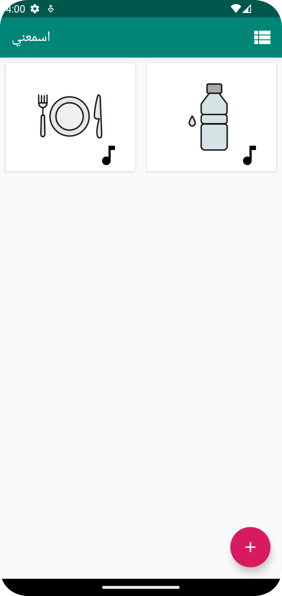
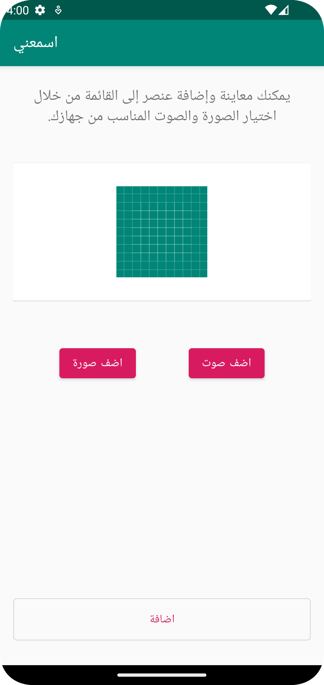

# Hear Me App

This is the repository for the Hear Me app that students build during [the Android Degree at Barmej.com](https://www.barmej.com/degree/android)

This app is a simple Android app that allows users to add a list of photos alongside a voice attached to each photo. The purpose of this app is to help the deaf and dumb communicate with the community. Where they can add photos and voice to everyday things then when they need they can click the item they want and the app will speak the attached voice!. In this application students will learn about new concepts such as using [Menus](https://developer.android.com/develop/ui/views/components/menus), [Permissions](https://developer.android.com/guide/topics/permissions/overview), dealing wilth multimedia files using [MediaPlayer](https://developer.android.com/guide/topics/media/mediaplayer) and accessing documents and other files from shared storage using [SAF](https://developer.android.com/training/data-storage/shared/documents-files).

To use this repository, fork/clone it, or download a zip using the green "Clone or download" button at the top of the file list.

# Screenshots
 

# Contributing
All contributions are welcome and gratefully accepted.

# License

A copy of the license is also available in the [license file](LICENSE).

# Demo

